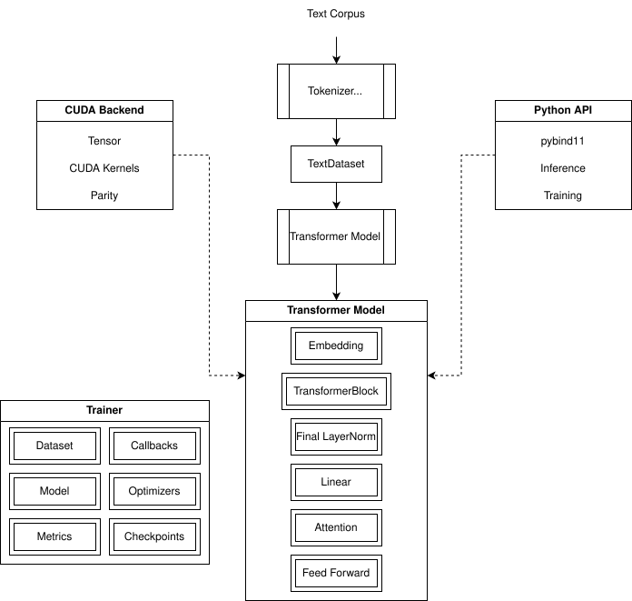
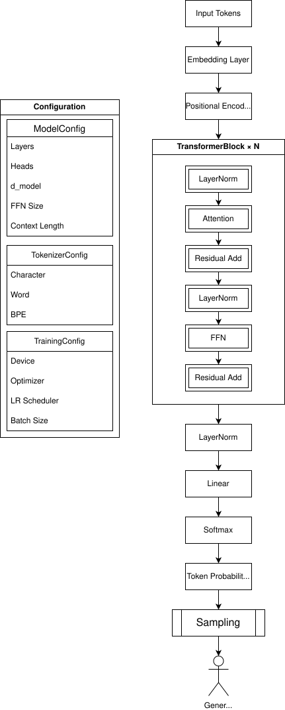

# Transformer_Toy

A C++ learning and experimentation framework for building, inspecting, and modifying Transformer-style architectures from first principles.

## Project Overview

**Transformer_Toy** is a from-scratch C++20 implementation of a decoder-only Transformer architecture designed for learning, experimentation, and research. The project intentionally avoids relying on deep-learning frameworks for the core implementation, instead building the major components—including tensors, attention, optimization, checkpointing, CUDA acceleration, and training infrastructure—from first principles.

Originally developed as a personal learning project during my graduate studies, Transformer_Toy has evolved into a modular experimentation platform for investigating architectural variants, performance optimizations, and future AI safety research.

## Project Status

The native C++/CUDA training and generation pipeline is operational. Current development focuses on exposing the existing implementation through a Python API using pybind11.

## Current Features

- From-scratch CPU tensor and neural-network implementation
- CUDA-accelerated execution
- Character, Word, and BPE tokenization
- Single-head and multi-head causal attention
- Configurable decoder-only Transformer architecture
- Manual backward implementations
- SGD and Adam optimizers
- Checkpoint save/load support
- Callback-based training infrastructure
- Early stopping and learning-rate scheduling
- CPU/CUDA parity testing
- Text generation with temperature and top-k sampling
- pybind11 Python API under active development

## Architecture

### Project Architecture



### Model Architecture



## Repository Structure

```text
Transformer_Toy/
├── src/                        # C++ and CUDA implementation
│   ├── core/                   # Tensor and mathematical utilities
│   ├── data/                   # Tokenizers and dataset loading
│   ├── kernels/                # CUDA kernels and wrappers
│   ├── layers/                 # Neural-network layers
│   ├── models/                 # Transformer model implementation
│   ├── tests/                  # Native tests and test harness
│   └── training/               # Training, optimization, and callbacks
├── include/                    # Public headers; mirrors src/
├── python/
│   ├── binding_tests/          # Python binding tests
│   ├── transformer_toy/        # Python package
│   └── bindings.cpp            # pybind11 module definitions
├── data/                       # Example corpora and data files
├── diagrams/                   # Architecture diagrams
├── CMakeLists.txt              # CMake build configuration
├── requirements.txt            # Python development dependencies
├── dev.ps1                     # Development environment helper
└── README.md
```

## Build Instructions

These instructions describe the currently tested Windows build environment. Other platforms may require adjustments.

**Tested environment**

- Windows 11
- Visual Studio with the MSVC C++ toolchain
- CMake
- CUDA Toolkit
- Python 3.13

### Prerequisites

- C++20 compatible compiler (e.g., GCC 10+, Clang 10+, MSVC 2019+)
- CUDA Toolkit (for GPU support)
- CMake 3.20 or higher
- Python 3.13 or higher
- pybind11

### Clone the repository

```Powershell
git clone https://github.com/Huraharah/Transformer_Toy.git
cd Transformer_Toy
```

### Create Python virtual environment

```Powershell
python -m venv .venv
.\.venv\Scripts\Activate.ps1

pip install --upgrade pip
pip install -r requirements.txt
```

### Configure CMake

```Powershell
cmake -S . -B build `
    -DPython_EXECUTABLE="$PWD/.venv/Scripts/python.exe" `
    -Dpybind11_DIR="$PWD/.venv/Lib/site-packages/pybind11/share/cmake/pybind11"
```

### Build

```Powershell
cmake --build build --config Release
```

### Verify the native build

```powershell
.\build\bin\Release\transformer_toy_tests.exe --core
```

### Verify the Python bindings

```Powershell
$env:PYTHONPATH="$PWD/python;$PWD/build/lib/Release"

python
```

```python
import transformer_toy as tt

print(tt.cuda_available())
```

### Reconfigure after CMake changes

```Powershell
Remove-Item -Recurse -Force build
cmake -S . -B build `
    -DPython_EXECUTABLE="$PWD/.venv/Scripts/python.exe" `
    -Dpybind11_DIR="$PWD/.venv/Lib/site-packages/pybind11/share/cmake/pybind11"

cmake --build build --config Release
```

## Native Test Harness Usage

```
.\build\bin\Release\transformer_toy_tests.exe [options]
   Options:
     --smoke               Run smoke tests
	 --smoke -C/-c         Run smoke tests on CPU
     --smoke -G/-g         Run smoke tests on GPU
	 --shakedown           Run shakedown tests
	 --shakedown -C/-c     Run shakedown tests on CPU
	 --shakedown -G/-g     Run shakedown tests on GPU
     --profiler            Run profiler benchmarking tests
     --profiler -C/-c      Run profiler benchmarking tests on CPU
     --profiler -G/-g      Run profiler benchmarking tests on GPU
     --bypass              Bypass unit tests
     --core                Run core tests
     --accel               Run accelerator tests
     --forward-parity      Run forward parity tests
     --backward            Run backward tests
     --backward-parity     Run backward parity tests
     --optimizer-parity    Run optimizer parity tests
	 --config              Run configuration tests
     --checkpoint          Run checkpointing tests
     --generate-best       Load best checkpoint and run generation suite
     --tokenizer           Run tokenizer specific tests from update
```

## Project Roadmap

This is an ongoing project, and the roadmap is subject to change. The current milestones are as follows:

### Milestone 1 — Core Forward Logic

Status: Complete

Implemented:
- CPU Tensor class
- Random initialization utilities
- Linear layer
- Embedding layer
- LayerNorm
- Math utilities
  - softmax
  - ReLU
  - GELU
  - cross-entropy loss
  - perplexity
  - token accuracy
- Single-head causal self-attention
- FFN layer
- TransformerBlock
- Transformer model shell
- Character tokenizer
- Text dataset loader
- Random batch sampling
- Temperature sampling
- Top-k generation
- Basic evaluation metrics

### Milestone 2 — Multi-Head Attention and Architecture Controls

Status: Complete

Implemented:
- MultiHeadAttention layer
- Configurable attention type
  - single-head
  - multi-head
  - mixed per block
- Attention debug toggles
- ModelConfig and GenerationConfig structs
- Cleaner CLI/test harness
- Runtime controls for:
  - number of layers
  - embedding dimension
  - FFN hidden dimension
  - number of heads
  - context length
  - temperature
  - top-k

### Milestone 3 — Training Infrastructure

Status: Complete

Implemented:
- Manual backpropagation for selected layers
- Gradient propagation through the training pipeline
- Optimizer support
  - SGD
  - Adam
- Gradient checking utilities
- Training loop
- Checkpoint save/load
- Loss tracking over time

#### Milestone 3.5 — CUDA Acceleration Refactor

Status: Complete

Completed:
- Refactor Tensor to be device-aware
- CUDA utility functions and error checking
- CPU/GPU copy and fill tests
- GPU SGD
- GPU Adam
- GPU CrossEntropyLoss
- GPU Dense/Linear
- GPU Transformer component pass
- Trainer device config
- CPU vs GPU parity tests

### Milestone 4 - Shakedown and Final Adjustments

Status: Complete

Completed:
- Epoch callback
- Learning rate scheduler
- Early stopping with configurable patience
- CUDA optimizations

#### Milestone 4.5 - Tokenization Updates, Optimizations

Status: Complete

Completed:
- Added BPE and word tokenization
- Perform optimization pass (both CUDA and CPU optimizations for using more of available resources)
	- tokens/sec on CPU and CUDA
	- average step time
	- GPU utilization
	- peak VRAM
	- host-to-device transfer volume
	- validation loss per wall-clock hour
- Full transformer build on full Shakespeare corpus

### Milestone 5 - Python Bindings

Status: In Progress

Planned:
- Set up pybind11 and the Python extension build
- Validate the native module
  - import the module from Python
  - report CUDA availability
  - confirm C++ exceptions propagate correctly
- Add inference-only bindings
  - expose tokenizer configuration/loading
  - construct a model from configuration
  - load a trained checkpoint
  - generate text from Python
- Add a simple training interface
  - construct dataset, model, optimizer, and training session
  - train from a corpus path
  - return training history and checkpoint information
- Expose advanced configuration
  - model architecture
  - tokenizer settings
  - training controls
  - generation settings
  - device selection
- Package and usage validation
  - stable Python package layout
  - Release build installation
  - minimal inference and training examples

#### Post–Milestone 5 architectural completion

- Implement dropout operation
- Apply attention dropout
- Apply attention projection dropout
- Apply block residual dropout
- Apply FFN dropout
- Apply model embedding dropout
- Honor pre_norm versus post_norm
- Honor use_bias throughout configured layers
- Verify causal config behavior
- Add training/evaluation mode switching

### Milestone 6 — Architectural Experiments

Planned:
- Deep FFN mixer
- Gated FFN / SwiGLU-style mixer
- CNN mixer
- GRU/LSTM mixer
- Hybrid block layouts
- Single-head vs multi-head comparisons
- Mixed attention-depth experiments

### Milestone 7 — Task Adapters

Planned:
- Text generation task
- Code/debug trace modeling
- Machine-code/debugging assistant experiments
- Graphormer-lite for graph tasks
- Possible image recognition adapter

### Milestone 8 — Research Evaluation

Planned:
- Compare architectures across task types
- Track loss, perplexity, accuracy, runtime, memory use
- Evaluate inductive bias suitability by domain
- Prepare results for possible paper/report

-------

## Design notes

- Input shape:        [batch, seq_len, d_model]
- Head count:         num_heads
- Head dimension:     d_head = d_model / num_heads
- Q/K/V projections:  d_model -> d_model
- Attention scores:   [batch, heads, seq_len, seq_len]
- Attention output:   [batch, seq_len, d_model]

_________

## Project Scope

Transformer_Toy is an educational and research-oriented implementation rather than a production machine-learning framework. It prioritizes inspectability, architectural experimentation, and explicit implementations of core mechanisms while still exploring CPU and CUDA performance optimization.

Issues and technical feedback are welcome.

The API and internal architecture remain under active development.